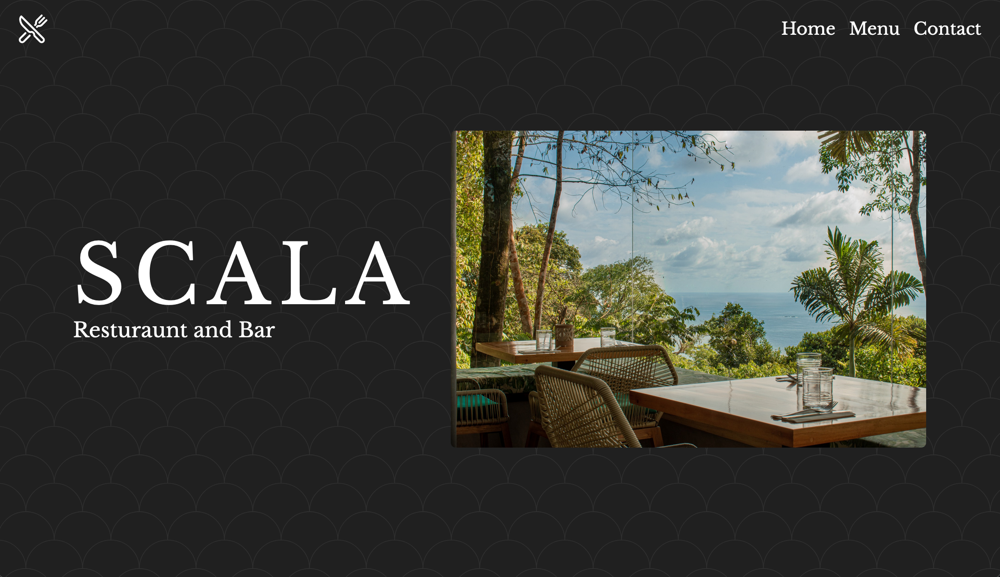

# Project: Restaurant Page

A simple landing page built with vanilla JavaScript, styled with Tailwind CSS.

[Live Preview](https://supersakana.github.io/scala_dominical/)

## About

This app is based on The Odin Project's [Restaurant Page](https://www.theodinproject.com/lessons/javascript-restaurant-page) criteria. It was my first time using Webpack and I really enjoyed the process of building the elements using only JavaScript. Check out the live preview and code.
